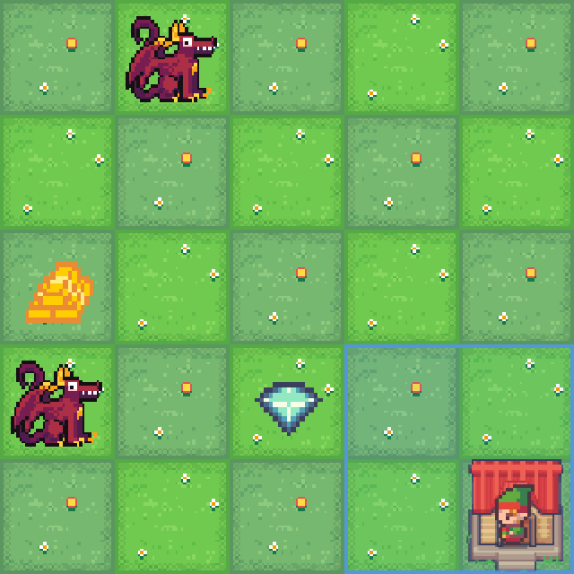
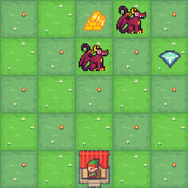

# Neo-Gathering
A redesigned version of the "[Resource Gathering](https://mo-gymnasium.farama.org/environments/resource-gathering/)" environment for Reinforcement Learning in the Gymnasium framework.

|          | NeoGathering | ResourceGathering |
|  -----   | -------------|-------------------|
|          |  |  |
| Map Size | Adjustable `map_size=(10,10)` + seeded | One map |
| Observations | Adjustable area around agent `obs_window=(3,3)` | x,y-position, has_gold and has_diamond | 
| Num Items | Adjustable via `num_gold`, `num_silver`, `num_dragons` | Fixed |
| Shortest Path | Via A* search `env.shortest_path()` | - |


# Installation

Install this repository with `uv`

```bash
uv add "git+https://github.com/joshuawe/Neo-Gathering"
```

(or using `pip`: `pip install "git+https://github.com/joshuawe/Neo-Gathering"`)

# Usage

Use the environment via

```Python
import gymnasium as gym
import neo_gathering

env = gym.make(
    "neo-gathering-v0",
    render_mode="rgb_array",
    map_size=(10, 10),
    obs_window=(3, 3),
    num_gold=10,
    num_silver=5,
    num_dragons=4,
)
```


# Development & Contribution

Tests are written in the `pytest` framework and stored under `tests/`. Use `uv run pytest` to run all tests.


# Benchmark

Measured with `gymnasium.utils.performance` (`target_duration=10s`, `seed=42`) on a 5×5 map with a 5×5 observation window. Run `uv run python scripts/benchmark.py` to reproduce.

| Metric | neo-gathering | resource-gathering | ratio [new/old] |
|---|---|---|---|
| Init | 2 590 inits/s | 3 691 inits/s | 0.70x |
| Step | 117 163 steps/s | 174 720 steps/s | 0.67x |
| Render | 1 597 frames/s | 1 729 frames/s | 0.92x |

**Notes**

- The step gap is structural: resource-gathering returns a flat 4-integer observation `(x, y, has_gold, has_gem)`, while neo-gathering returns a full 5×5 window slice — roughly 6× more data per step.
- Init is slower primarily due to random map generation (`create_map`) and pre-computing the padded map on each reset.
- Render performance is nearly on par (0.92x).
- Further throughput gains are best achieved via vectorised environments (`gymnasium.vector`) or a future JAX implementation, rather than single-env Python optimisation.